# Plant Guardian

An AI/ML powered plant monitoring and care application built with Flutter.

- At [Plant Agent Repo](https://github.com/MikeCheek/plant-agent) there's the code for the AI agent backend using Hugging Face's smolagents library.

- At [Plant DB Bot Repo](https://github.com/MikeCheek/plant-db-bot) there's the code for expanding the plant database in a telegram bot.

- At [Kaggle Notebook](https://www.kaggle.com/code/michelepulvirenti/house-plant-recognition-using-efficientnetv2b0) there's the notebook used to train the plant species classifier.

_Disclaimer: This project is currently in its early stages of development. Features and functionalities are subject to change._

## Why this project?

I have always been passionate about nature and technology.
This project combines both interests by leveraging AI and ML to help people care for their plants more effectively.

The app aims to provide real-time plant identification, disease detection, and personalized care recommendations, making plant care easier and more accessible.

Furthermore, it serves as a practical application of my skills in Flutter development and machine learning but also as a way to learn more about plant care and horticulture.

## Features

- [x] Theme mode (light/dark)
- [x] ML plant classifier (TensorFlow Lite model)
- [x] Live camera classifier (real-time predictions)
- [x] AI agent chatbot (GuardAI)
- [x] User authentication (accounts, secure sign-in)
- [ ] ML plant disease classifier (detect diseases & severity)
- [x] Working AI Agent with tools (planner, web/tool access)
- [x] My Garden management (add/remove plants, metadata)
- [ ] Notification reminders (watering, fertilizing, care tips)
- [ ] Garbage recycling helper (identify & sort waste)

## Screenshots from Early Development

<figure style="display:flex; flex-direction:column; align-items:center; margin:0;">
    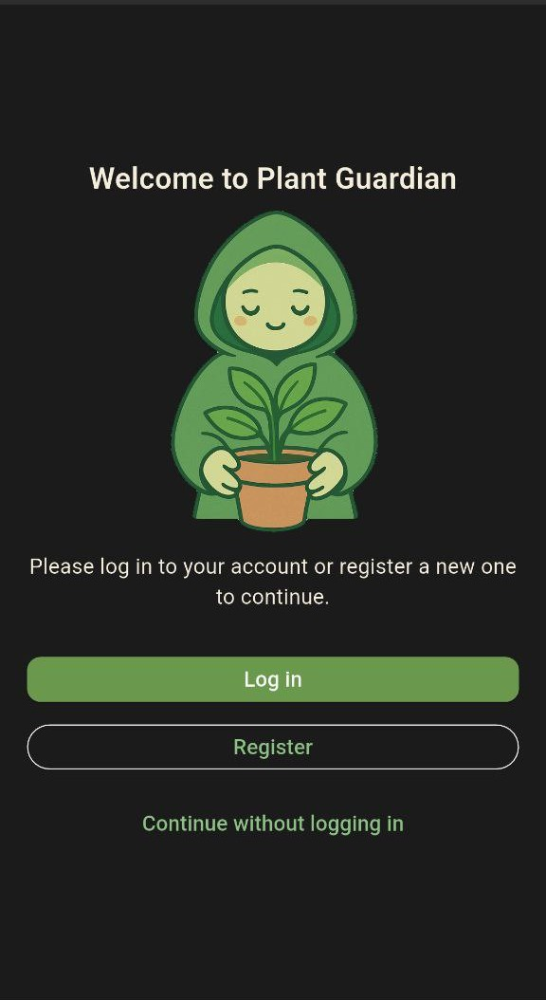
  </figure>

### Live camera predictions

To perform the plant species prediction, the app uses a trained TensorFlow Lite model integrated with the device's camera.

The notebook used to train the model can be found on my kaggle profile [here](https://www.kaggle.com/code/michelepulvirenti/house-plant-recognition-using-efficientnetv2b0).

#### Final Model Performance

|   Metric | Training | Validation |
| -------: | -------: | ---------: |
| Accuracy |      94% |        92% |
|     Loss |      20% |        37% |

### Below are some example predictions made by the app:

<div style="display:flex; gap:1rem; align-items:flex-start; flex-wrap:wrap;">
  <figure style="display:flex; flex-direction:column; align-items:center; margin:0;">
    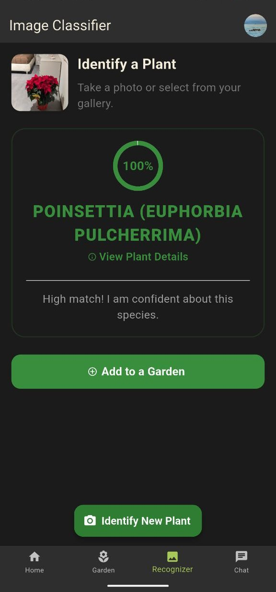
  </figure>

  <figure style="display:flex; flex-direction:column; align-items:center; margin:0;">
    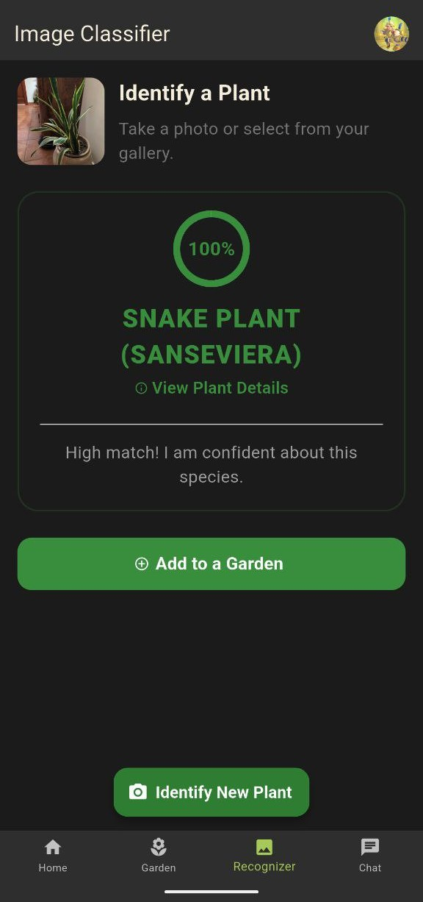
  </figure>

  <figure style="display:flex; flex-direction:column; align-items:center; margin:0;">
    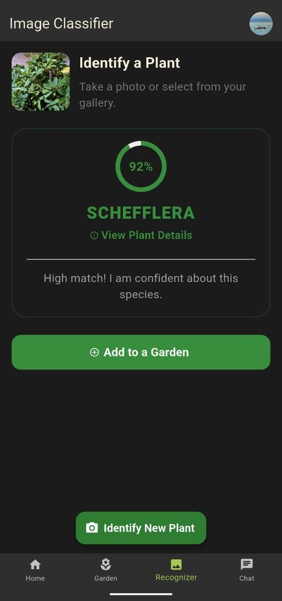
  </figure>

  <figure style="display:flex; flex-direction:column; align-items:center; margin:0;">
    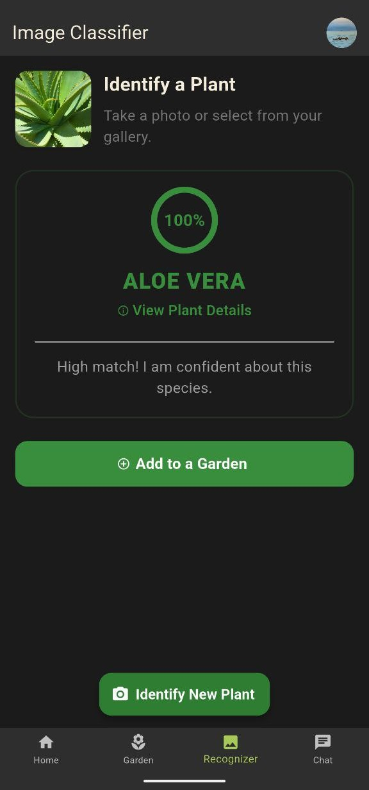
  </figure>
</div>

Here there are more example made with old UI design:

<div style="display:flex; gap:1rem; align-items:flex-start; flex-wrap:wrap;">

  <figure style="display:flex; flex-direction:column; align-items:center; margin:0;">
    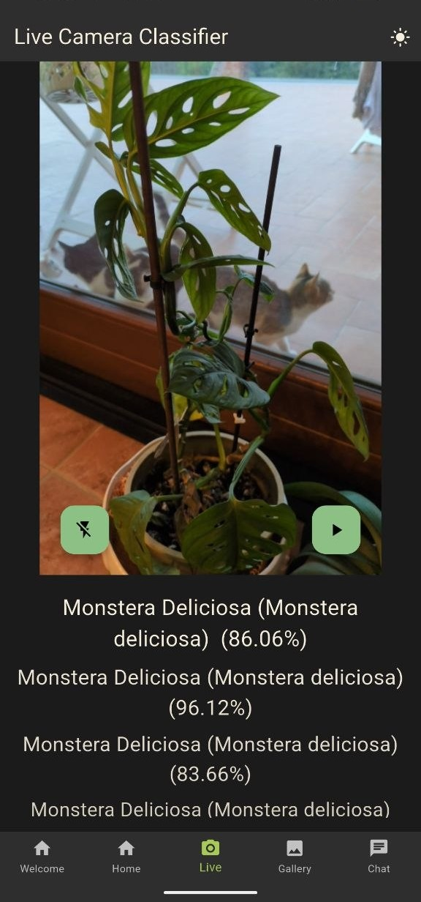
  </figure>

  <figure style="display:flex; flex-direction:column; align-items:center; margin:0;">
    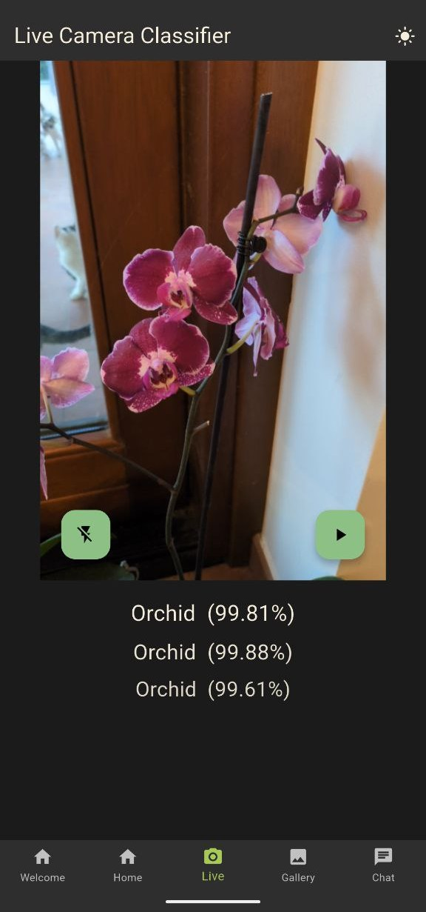
  </figure>

   <figure style="display:flex; flex-direction:column; align-items:center; margin:0;">
    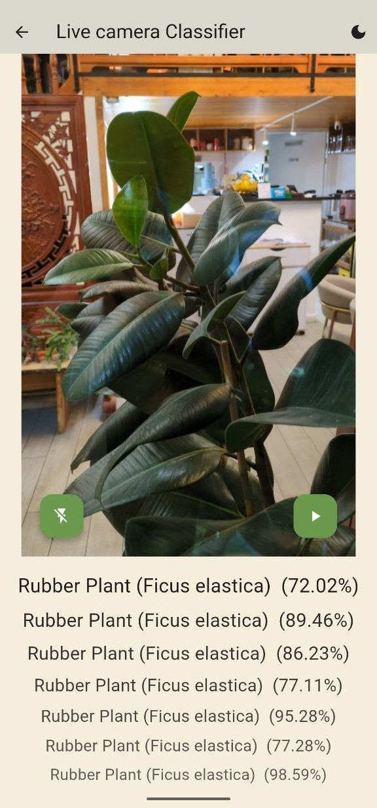
  </figure>

## GuardAI - AI Agent for Plant Care

<figure style="display:flex; flex-direction:column; align-items:center; margin:0;">
    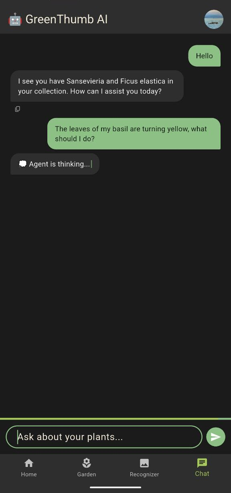
  </figure>

<figure style="display:flex; flex-direction:column; align-items:center; margin:0;">
    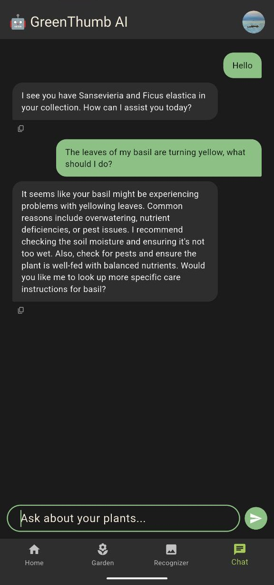
  </figure>

## Garden Management

<figure style="display:flex; flex-direction:column; align-items:center; margin:0;">
    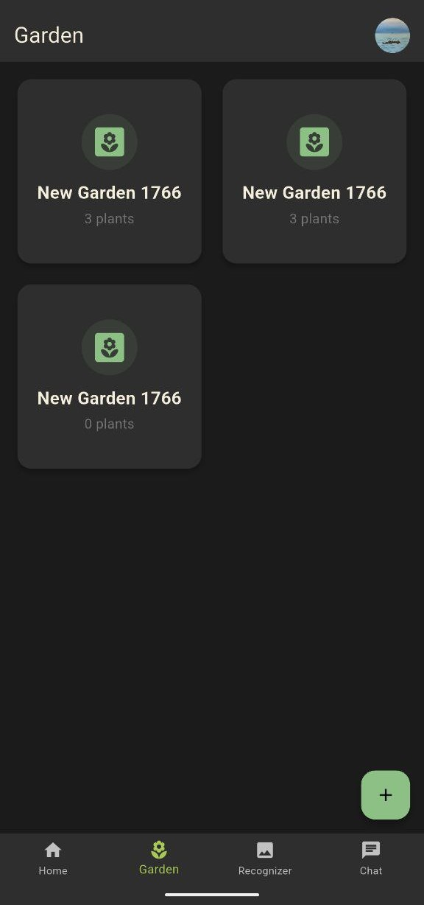
  </figure>

<figure style="display:flex; flex-direction:column; align-items:center; margin:0;">
    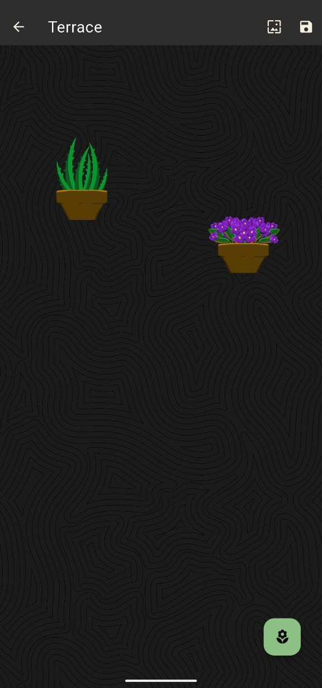
  </figure>

## Running the App

```bash
flutter run --dart-define-from-file=config.json
```

```bash
flutter build apk --dart-define-from-file=config.json
```
