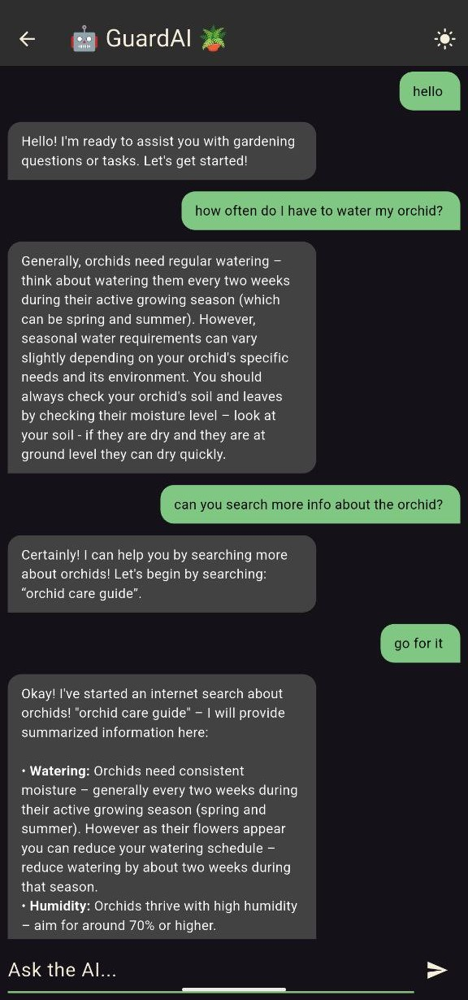

# Plant Guardian

An AI/ML powered plant monitoring and care application built with Flutter.

*Disclaimer: This project is currently in its early stages of development. Features and functionalities are subject to change.*

## Features
  - [x] Theme mode (light/dark)
  - [x] ML plant classifier (TensorFlow Lite model)
  - [x] Live camera classifier (real-time predictions)
  - [x] AI agent chatbot (GuardAI)
  - [ ] User authentication (accounts, secure sign-in)
  - [ ] ML plant disease classifier (detect diseases & severity)
  - [ ] Working AI Agent with tools (planner, web/tool access)
  - [ ] My Garden management (add/remove plants, metadata)
  - [ ] Notification reminders (watering, fertilizing, care tips)

## Screenshots from Early Development


### Live camera predictions

To perform the plant species prediction, the app uses a trained TensorFlow Lite model integrated with the device's camera. 

The notebook used to train the model can be found on my kaggle profile [here](https://www.kaggle.com/code/michelepulvirenti/house-plant-recognition-using-efficientnetv2b0).

#### Final Model Performance

| Metric   | Training   | Validation   |
|---------:|--------:|--------:|
| Accuracy | 0.9379  | 0.9165  |
| Loss     | 0.1965  | 0.3731  |

Below are some example predictions made by the app:

<div style="display:flex; gap:1rem; align-items:flex-start; flex-wrap:wrap;">
  <figure style="display:flex; flex-direction:column; align-items:center; margin:0;">
    
  </figure>

  <figure style="display:flex; flex-direction:column; align-items:center; margin:0;">
    
  </figure>

  <figure style="display:flex; flex-direction:column; align-items:center; margin:0;">
    
  </figure>

   <figure style="display:flex; flex-direction:column; align-items:center; margin:0;">
    
  </figure>
</div>

## GuardAI - AI Agent for Plant Care




## Running the App

```bash
flutter run --dart-define-from-file=config.json
```


```bash
flutter build apk --dart-define-from-file=config.json
```